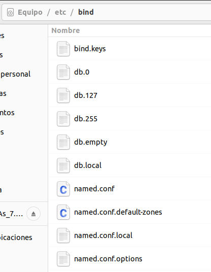
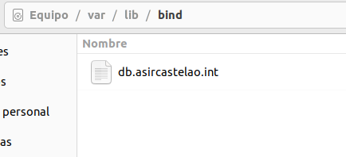
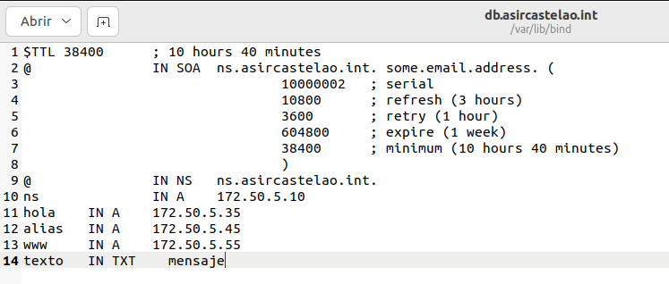
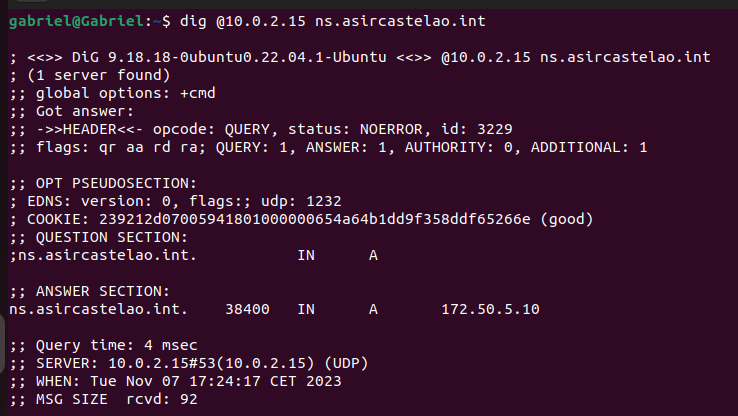

# Práctica 1.2 DNS-Linux

Estando una máquina virtual con Ubuntu se puede instalar "bind9" utilizando el siguiente comando:

***Se necesitan permisos de administrador***

    sudo apt install bind9

Una vez instalado el servicio podemos comprobar que funciona utilizando el siguiente comando

    systemctl status bind9

Luego podemos observa que bind9 trajo consigo un par de carpetas, como lo pueden ser "etc/bind" y "var/lib/bind"

En la carpeta "/etc/bind" podemos encontrar la configuración general del DNS

Luego, configuramos las zonas del DNS, en el documento que se ubica en "/var/lib/bind"

Una vez configurado el resto de archivos podemos comprobar que funciona mediante el uso del comando "dig" en el mismo servidor

